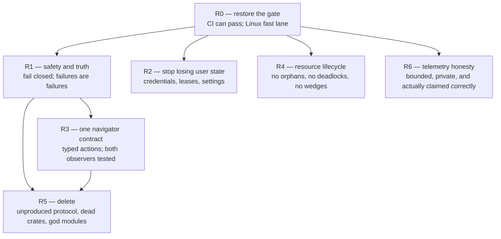

# 16 — remediation

The product plan (`PLAN.md`, `plans/00`–`15`) says what Starkbot Neo should
become. This document says what is wrong with the code that exists, and in
what order to fix it. It is derived from a full read of the 14 crates at
`653b3e2` and every finding below carries a `path:line`.

It is orthogonal to the milestone sequence. M2 work can proceed alongside
R1–R3; it should not proceed alongside R0, because until R0 lands nothing is
verified by anything.

## Status

**Wave 1 is done: R0, R1, R2, R4, R6, and R3.2/R3.4 plus the wait-spelling
slice of R3.1.** What remains is R3.1 proper (the typed action vocabulary),
R3.3 (`CFEqual`), R3.5 (the untested `neo-cdp`/`jev-nav`/`AxObserver`), and all
of R5 (deletions and the two god-module splits).

Verified on this machine: the Linux lane (`jev-nav --no-default-features`,
`neo-cdp`, `neo-otel`, `neo-keys`, `neo-core`, `neo-store`) is clippy-clean
under `-D warnings` and runs 103 tests in about seventeen seconds; the
TypeScript lane type-checks and runs 20. `neo-ax`, `neo-cdp`, `neo-core` and
`neo-keys` additionally **type-check for `aarch64-apple-darwin`** (see below),
which is how the macOS half of Contract 5 was checked. `neo-agent`, `neo-eval`,
`neo-tui` and `src-tauri` were changed by inspection only.

Two things wave 1 learned that change the plan:

- **A macOS cross-check works for more of the tree than expected, and the two
  things blocking the rest are swappable.** `cargo check --target
  aarch64-apple-darwin` succeeds today for `neo-ax` (all 5.9k lines of `objc2`
  FFI), `neo-cdp`, `neo-core` and `neo-keys`, given
  `CC_aarch64_apple_darwin=clang` and
  `CFLAGS_aarch64_apple_darwin=--target=arm64-apple-macos11` — which is what
  gets `objc2-exception-helper` to build its Objective-C shim. Every remaining
  crate is blocked by exactly two **C** dependencies that need the macOS SDK
  headers, not by anything Rust: `libsqlite3-sys` (via `rusqlite`'s `bundled`
  feature) and `aws-lc-sys` (via `rustls`, through `reqwest`). Moving `rustls`
  onto `ring`, and `rusqlite` off `bundled`, would put the entire workspace
  under a type-check that needs no Mac. That is worth measuring before
  committing to the alternative below.
- **`neo-ax` could also be `cfg`-gated the way `neo-keys` now is.** Contract 5
  moved `security-framework` under
  `[target.'cfg(target_os = "macos")'.dependencies]` and put `neo-keys`,
  `neo-core` and `neo-store` on the Linux lane. `neo-ax` is the one remaining
  macOS-only dependency between that lane and `neo-agent`, `neo-eval`,
  `neo-tui` and `src-tauri`. Note what each approach buys: a cross-check gives
  *type-checking* without a Mac, while `cfg`-gating `neo-ax` gives *running
  tests* on the fast lane. The second is worth more and costs more.
- **`R2.6`'s third bullet was wrong** and the entry below has been corrected:
  `ScreenLease::release` already decrements a depth and keeps the lock, so a
  balanced inner release does *not* free the screen early. Only the first half
  held — the `flock` excluded nothing within a process — and keying
  re-entrancy on `RunId`, which is what the roadmap proposed, would have
  refused every app case in the eval suite. The fix that shipped passes an
  explicit `ScreenScope`; nesting is declared, not guessed.

## 0. What the audit found, in one paragraph

The mechanisms are good and the seams are not. `neo-ax/src/table.rs`, the
`objc2` boundary in `sys.rs`, `Secret`, the migration fixtures, the `flock`
lease, the realtime audio callback and `fetch_codex` are all careful,
well-reasoned work. What fails is the code that joins two careful pieces
together: it fails open, returns `Ok` on failure, or asserts a contract in a
doc comment that the next line does not enforce. Six of the nine worst defects
are of that exact shape — **the comment is more rigorous than the code beneath
it** — which is also why they survived review, and why the fix is structural
(make the contract executable) rather than case-by-case.

Four patterns recur and are called out as such below:

| Pattern | Example | Item |
|---|---|---|
| Paid feature wired to nothing | `on_task` asked every step, read nowhere | R1.2 |
| Contract stated in prose, not types | two observers, two action vocabularies | R3.1 |
| Designed for multi-process, tested single-process | five `DEFERRED` transactions | R2.4 |
| Duplicated because there is no shared owner | store path spelled four times | R5.3 |

## 1. Sequence



R0 is a hard prerequisite for everything. R1 and R2 are independent of each
other and can run in parallel. R5 should come last of the code changes because
deleting a variant is cheap once nothing new is being written against it.

---

## R0 — restore the gate

**Why first.** `.github/workflows/ci.yml:25` cannot pass. The step is

```sh
! git grep -nE 'api\.openai\.com|typesafe\.ai|fal\.run|quiver\.ai' -- ':!plans/**' ':!spikes/**'
```

and six tracked sources match — all of them legitimate, allow-listed provider
modules (`neo-agent/src/nav.rs:21`, `providers/openai.rs:13`,
`oauth/client.rs:256-257`, `neo-voice/src/stt/openai.rs:22,313`). `git grep`
exits 0 on a match and `!` inverts it, so the job has been red on every push
since the rule landed. That is the reason R1.1 and R1.3 shipped: there was no
gate. Fixing individual defects while the gate is down buys nothing.

- **R0.1 — make the architecture rule express its actual intent.**
  `plans/05-platform.md:55` states the rule as "no vendor endpoint outside the
  allow-listed modules". The implemented grep has no notion of an allow-list.
  Either exclude the four provider paths explicitly, or invert it to deny
  vendor hosts in `crates/neo-tui/`, `crates/neo-cli/` and `ui/` only.
  *Acceptance:* the step passes on `main`, and fails when a vendor host is
  added to `neo-tui/src/state.rs`.

- **R0.2 — add a Linux fast lane.** `jev-nav`'s `ax` module is already
  feature-gated (`crates/jev-nav/src/lib.rs:6`, `Cargo.toml:12`) and `neo-cdp`,
  `neo-core`, `neo-store` and `neo-otel` have no macOS dependencies. So
  `cargo test -p jev-nav --no-default-features -p neo-core -p neo-store -p
  neo-cdp -p neo-otel` runs on `ubuntu-latest` in a fraction of the macOS
  runner's time, and covers the navigator step loop, the safety gate, the
  store and the exporter — where most of R1, R2 and R3 lives.
  *Acceptance:* a Linux job in CI, green, under two minutes with a cache.

- **R0.3 — gate the TypeScript half.** CI never runs `tsc --noEmit` or
  `vitest`, so `ui/src/store/reduce.test.ts` and `send.test.ts` gate nothing
  and a type error in `ui/src` is only found by `cargo tauri build`.
  *Acceptance:* `npm ci && npm run build && npm test` in `ui/` runs in CI.

- **R0.4 — add the command-name check.** `src-tauri/src/bindings.rs` pins
  *types* across the bridge (good; leave it alone) but nothing pins the 30
  command names in `ui/src/bridge/api.ts` against `generate_handler!`
  (`src-tauri/src/main.rs:48-79`). A rename is a runtime "command not found".
  *Acceptance:* a test that fails when a command is renamed on one side.

- **R0.5 — take the spikes out of the workspace.** Six spike members never opt
  in with `[lints] workspace = true`, so `unsafe_code = "deny"` was never
  applied to them — `spikes/s6-panel/src/main.rs:616,627` and
  `spikes/s7-webview/src/main.rs:87,100` contain raw `unsafe` blocks, against a
  plans rule that says `unsafe` lives in exactly three places. CI compiles two
  full Tauri apps for zero policy coverage. `plans/spikes.md` already records
  every conclusion, so the code is historical evidence, not a dependency.
  *Acceptance:* `members` lists `crates/*` and `src-tauri` only; spikes moved
  to `archive/spikes/` with their own workspace, or deleted with a note in
  `plans/spikes.md` naming the commit that held them.

- **R0.6 — bump the `BRIDGE_VERSION` automatically.** It is hand-maintained
  (`neo-agent/src/runtime.rs:40`, `ui/src/bridge/generated.ts:13`), so a stale
  `ui/dist` built one field-rename ago still reports `2` and passes
  `handshake` — the skew the handshake exists to catch.
  *Acceptance:* the version is a hash of the generated bindings, or the
  bindings test fails when the declarations changed and the version did not.

---

## R1 — safety and truth

### R1.1 — the safety gate must fail closed  *(highest severity in the repo)*

`crates/jev-nav/src/lib.rs:170`:

```rust
decision.safety.get(*head).copied().unwrap_or(0.0) >= config.confirm_at
```

A head is only present when `Evaluation::yes` returned `Some`
(`policy.rs:288-293`), and `yes` returns `None` for a missing key, a non-object
answer, a non-numeric value, `NaN`, or anything outside `0..=1`
(`wire.rs:60-68`). So a malformed, truncated or partially-parsed TypeSafe
response scores `outward`, `destructive` and `spends` at `0.0`, and the send,
the delete or the purchase executes **unconfirmed, unlogged and unevented**.

The asymmetry inside `wire.rs` is the whole bug: `Evaluation::choice`
(`wire.rs:40-58`) validates the probability simplex and returns `Err`;
`Evaluation::yes` returns `Option` and lets the caller decide. The caller
decided wrong.

*Fix:* when `config.safety_heads` is on, a head that was **requested** and came
back absent or malformed is `1.0` — or the step fails with
`WireError::Invalid(head)`. Prefer the latter: a provider returning garbage
should stop the run, not silently require confirmation for everything.

*Acceptance:* two tests in `crates/jev-nav/tests/navigator.rs`, both runnable
on the Linux lane. (a) A Jev answer with `outward: { noul: 0.9 }` blocks the
action. (b) The same answer with the `outward` key **omitted** does not
execute. Today no test exercises `risky` at all — `RunConfig { safety_heads:
false }` is the only configuration in the suite (`tests/navigator.rs:145`).

### R1.2 — `on_task`: wire it or delete it

The head is requested on **every step** (`jev-nav/src/rules.rs:44` feeds
`policy.rs:238`), stored in `decision.safety`, validated in `neo-core` with a
hard 0.15 floor (`settings.rs:398-404`), and rendered as an editable row in the
TUI (`neo-tui/src/state.rs:2795`). It is read by no code: `lib.rs:169` checks
only `outward`/`destructive`/`spends`. You pay per-step classifier latency for
it and show the user a knob that cannot change anything.

This is the template for the whole "paid feature wired to nothing" pattern; the
others (`intake.enqueue_at`/`offer_at` at `neo-core/src/settings.rs:152-163`,
`Guard.enabled`/`Guard.element` at `neo-ax/src/types.rs:399`) go in R5.

*Decision required:* on-task drift detection is a real product behaviour and
`plans/10-navigator.md` specifies it. Either implement it in the loop this
cycle, or remove the head from the request, the setting from `neo-core`, and
the row from the TUI, and re-add all three with the implementation.
*Acceptance:* either a test where a run that drifts off-goal ends `Blocked`, or
zero occurrences of `on_task` outside a plans document.

### R1.3 — a failed turn must not return `Ok`

`crates/neo-agent/src/agent/metal.rs:1297-1310`. The `RunOutcome::Failed` arm
builds `AgentError::Graph`, calls `reporter.fail(&error)`, and then — under a
comment reading *"the caller gets the error"* — returns a `TurnOutcome`.

Consequences: `neo-tui/src/run.rs:902` renders a crashed turn as an answer, and
`neo-eval/src/lib.rs:176-180` scores it `error: None`, so **`ExpectNoError`
passes on a turn where a node blew up**. Every eval number produced so far is
suspect.

*Fix:* `finish` returns `Result<TurnOutcome, AgentError>`; the `Failed` arm
returns `Err`. *Acceptance:* a test drives `drive` with a model that errors
mid-run and asserts the caller receives `Err`; the eval suite re-run produces
different (honest) numbers.

### R1.4 — cancellation is typed, not string-matched

`metal.rs:1559-1566` classifies cancellation with
`error.to_string().contains("cancelled")`, against a message the producer side
writes as `GraphError::Node { node: "tools", message: "cancelled" }`
(`metal.rs:885-888`). A metalcraft reword, or any vendor error containing the
word, flips the classification — and `RunOutcome::Failed` (R1.3) never calls
`graph_error` at all, so a cancellation arriving on that path surfaces as a red
error card. Related: `error_code` maps *every* `AgentError::Core(_)` to
`agent_cancelled` (`metal.rs:1546`), while `is_cancelled()` correctly checks
only `CoreError::Cancelled`.

*Fix:* a typed cancellation (sentinel error or `GraphError::Cancelled`), one
mapper, both paths through it. *Acceptance:* a stopped turn is never published
as `TurnFailed`, asserted for both the `Cancelled` and `Failed` arms.

### R1.5 — the webview stops reading error prose

`ui/src/store/runs.ts:160` does `/cancel/i.test(error)` to tell "stopped" from
"broken", while `src-tauri/src/error.rs:24` defines `pub const CANCELLED`
specifically so a front end would not have to. The constant never crosses the
bridge: `AppEvent::TurnFailed` carries only `error: String`.
*Fix:* add `code: String` to `TurnFailed`. *Acceptance:* no regex over error
text in `ui/src`.

---

## R2 — stop losing user state

### R2.1 — single-flight the OAuth refresh

`crates/neo-agent/src/runtime.rs:508-531` checks the token cache, drops the
lock, and awaits `store.access_token_at(...)` with nothing serialising two
callers. Two overlapping turns both POST `grant_type=refresh_token` with the
same token; against a vendor that rotates refresh tokens — OpenAI does, and
`oauth/client.rs:471` asserts `rt_new` — the loser gets `invalid_grant`,
`is_dead_grant` matches, and `oauth/store.rs:170` calls `self.clear(provider)`.
**The user's stored credential is deleted mid-turn.**

*Fix:* a per-provider `tokio::sync::Mutex` around the refresh, re-checking
`needs_refresh` after acquiring. *Acceptance:* a test issues two concurrent
`oauth_token` calls against a wiremock that rotates and 400s the second refresh,
and asserts one network refresh and a surviving credential.

### R2.2 — `oauth_account` must not report `SignedOut` on a transport error

`runtime.rs:441-460` maps `Err(_)` to `SignedOut`. The same crate applies the
opposite — correct — rule to API keys: `key_check.rs:82` folds every
reachability failure into `Unchecked`, pinned by
`tests/key_validation.rs:105-113`. So an offline user is correctly told nothing
about their key and incorrectly told their subscription is gone.
*Fix:* match `OauthError::SignedOut` only.

### R2.3 — the dev keychain must not destroy itself

`crates/neo-keys/src/keychain.rs:319` does
`serde_json::from_str(&text).unwrap_or_default()` and writes the result back, so
one truncated or hand-edited `keys.json` causes the next `set()` to replace the
whole store with a single entry — wiping every other account. `read_file:296`
correctly errors on the same input. **This backend is the default in debug
builds** (`keychain.rs:134`).

Two related hazards in the same area: the read-modify-write at `319-337` takes
no lock, so two processes setting different accounts lose one write; and
`.cargo/config.toml` sets `NEO_KEYCHAIN_BACKEND = "file"` unconditionally, which
overrides the `cfg!(debug_assertions)` guard — so `cargo run --release` from the
checkout writes plaintext secrets, which the file's own comment assumes cannot
happen.

*Fix:* propagate the parse error; lock the read-modify-write; make the file
backend refuse a release build unless `NEO_KEYCHAIN_FILE` is set explicitly.

### R2.4 — five transactions go `DEFERRED` → `IMMEDIATE`

`neo-store/src/settings.rs:37`, `conversations.rs:178,236,328`,
`models.rs:83`. Each reads and then writes under
`TransactionBehavior::Deferred`. Within one process the single writer thread
serialises them; **across** processes — which WAL, four readers, the whole
`presence` module and `Resource::Chrome` exist for — the upgrade after another
connection committed returns `SQLITE_BUSY_SNAPSHOT`, which `busy_timeout`
(`connection.rs:77`) does not retry. The user sees "database is locked" when
patching settings from the desktop app while the TUI is open.

The test that should catch this is `neo-store/src/tests.rs:165`
`concurrent_patches_to_one_section_do_not_lose_fields` — two threads against one
writer actor, serialised by construction. It asserts nothing about concurrency
while implying it does, and it is the reason the hole is invisible.

*Acceptance:* that test rewritten to use two `Store` handles on one file; it
must fail before the `IMMEDIATE` change and pass after.

### R2.5 — settings must survive an unknown key

`neo-store/src/settings.rs:84` rebuilds `Settings` from stored blobs, and every
section carries `#[serde(default, deny_unknown_fields)]`
(`neo-core/src/settings.rs:355-357`). A downgrade, a rollback, or any future
field rename makes `load()` return `StoreError::Json`, which propagates through
`Runtime::settings()` into `bootstrap()` and fails every surface with no repair
path. The DB has a forward-compat guard (`StoreError::NewerSchema`) but it
covers `user_version` only; the settings JSON is never migrated.
*Fix:* tolerant per-section deserialization that strips and warns, or a
settings-format version with a blob migration.

### R2.6 — one keyboard lease mechanism, not two

`ScreenLease` (`neo-agent/src/screen.rs`, `flock`) and `Resource::Keyboard`
(`neo-store/src/presence.rs`, SQLite + TTL) guard the same resource with
near-identical prose justifications and different failure models. They will
disagree, and the one that grants while the other refuses is the one that lets
two agents type at once. Three concrete defects between them:

- `presence.rs:235` — `sessions()` runs `DELETE FROM sessions WHERE last_seen <
  ?1` and `migrations/0005…sql:34` declares `leases.holder REFERENCES sessions
  ON DELETE CASCADE`. So `neo sessions`, the TUI picker or
  `doctor::sessions_check` **evicts a live process's keyboard lease** because
  its heartbeat was slow. The victim never learns: `heartbeat` discards
  `changes()`.
- `presence.rs:207` — `heartbeat` is the only thing that renews
  `expires_at`, and its only caller is the TUI (`neo-tui/src/run.rs:113`). Every
  `neo app …` run longer than `LEASE_TTL_MS = 30_000` loses its claim silently.
- `screen.rs:155` — `acquire` increments `depth` without comparing the
  acquiring `RunId`, so the flock excludes nothing *within* a process, and a
  nested release frees it while the outer run is still typing.

*Fix:* keep the `flock` — kernel-released, no TTL, no renewal contract, already
tested against a stale record. Key its re-entrancy on `RunId`. Delete
`Resource::Keyboard` and `Resource::App`; `presence` keeps the roster only.
*Acceptance:* a test asserts two independent runs in one process are refused.

---

## R3 — one navigator contract

### R3.1 — the action vocabulary becomes a type

`jev-nav/src/ax.rs:124-131` emits AX controls as `{"kind":"control","id":"WAIT"}`;
`jev-nav/js/snapshot.js:195` emits `{id:'wait',kind:'wait'}`. The loop tests
`action["kind"] != Some("wait")` in two places — the risky-action bypass
(`lib.rs:175`) and the stuck detector (`lib.rs:240`) — and only knows the web
spelling. On the native path: three consecutive `WAIT`s, which is exactly what
`NEXT_ACTION` instructs while a sheet loads, end the run
`Blocked("three actions in a row changed nothing")`; and a safety head firing on
a `WAIT` blocks instead of waiting.

`observer.rs:36-38` documents the observation shape in prose and nothing types
it. That is the "contract in prose" pattern; this is the item that fixes it.
*Fix:* a shared `Action` enum both observers construct. *Acceptance:* the two
`kind == "wait"` string comparisons are gone.

### R3.2 — `SELECT` on the native path works or is withdrawn

`jev-nav/src/ax.rs:246-256` resolves `AxAction::SelectOption` from
`text.or(action["option"])`, but `lib.rs:186` computes `typed` only when
`kind == "fill"`, and `actions_of` (`ax.rs:105-112`) emits `options` (a list)
and `value` — never `option`. Every SELECT returns `stale("the decision named
no option")` and, after `MAX_CONSECUTIVE_STALE`, ends the run `Blocked`. The
operation is *advertised*: `mapping.rs:168-170` emits it for every enabled
`AXRadioGroup`/`AXTabGroup`/`AXSegmentedControl`/`AXComboBox`.
*Fix:* emit one action per option, as `snapshot.js` already does for `<select>`,
so `policy::action_space` can build `index:N` targets.

### R3.3 — element identity uses `CFEqual`

`neo-ax/src/sys.rs:200-201` compares `AXUIElement`s with `std::ptr::eq`.
`AXUIElementCopyElementAtPosition` and `AXParent` mint *new* objects for the
same element; AX identity is `CFEqual`. Every caller is `is_same_or_related`
(`sys.rs:721`), which feeds `occlusion_check` (`actor.rs:754`) — so the hit-test
and both parent walks return false for elements that are the same, and only the
"hit frame encloses the target" escape hatch at `actor.rs:779` (added, per its
own comment, because "every button would be permanently occluded") makes
anything execute. That workaround weakens the occlusion guard to "any enclosing
same-app rect passes".
*Fix:* `CFEqual`, then delete the escape hatch and see whether the guard still
holds. *Acceptance:* occlusion tests pass without the containment fallback.

### R3.4 — the element budget survives the frame merge

`snapshot.js:189-191` caps at 250 **per execution context**; `web.rs:228-230`
runs it in every child frame and does `actions.extend(additions)` with no
re-cap. Six iframes → ~1,750 actions, blowing the request size, the latency
budget and the index space the TARGET head chooses from. Worse,
`omitted_actions` is summed at `web.rs:241` and `cross_origin_frames` written at
`:242`, and `policy::build_request` (`policy.rs:196-228`) puts neither in the
state — **the model is never told controls were dropped**, so it answers `DONE`
when its target was truncated away.
*Fix:* cap after the merge; surface `omitted_actions` in the request.

### R3.5 — the untested 60%

`neo-cdp/src/lib.rs` has **zero** tests across 846 lines including message
correlation, the 30 s timeout, `pending` clearing on disconnect and frame/session
mapping. Every `jev-nav` module except the integration suite has zero:
`policy.rs`, `wire.rs`, `web.rs`, `ax.rs`, `text.rs`. `action_space` (index
assignment, `index:option` targets) and `Evaluation::choice` (simplex validation,
argmax agreement, unknown-id rejection) are pure functions with tricky
invariants and no coverage.

`AxObserver` has no test — `actions_of`, `marker_of`, `observation_of` and the
index→`Ref` round trip are all pure, and any one of them would have caught R3.2
on the first assertion. Also untested: `spread`'s index-stability property,
which its own doc comment says the whole design exists for.

All of this runs on the R0.2 Linux lane.

---

## R4 — resource lifecycle

- **R4.1** `neo-tui/src/run.rs:159-163` — `Job::drop` does `cancel()` then
  `abort()` back to back, so the abort flag lands before the cancelled task can
  be polled to run its browser-close path. **Quitting the TUI orphans Chrome**,
  which is precisely the failure the comment three lines above describes.
  `Jobs::cancel_all` is the correct graceful path and is what `Esc` uses; `Drop`
  — the quit path — is not. *Fix:* `Drop` cancels only; the loop drains settled
  jobs with a bounded deadline.
- **R4.2** `neo-tui/src/run.rs:1202` — `with_terminal_released` discards the
  terminal returned by `ratatui::try_init()` and keeps drawing through the stale
  one, whose back buffer holds the pre-handover frame while the real screen was
  blanked. Every vendor login leaves a half-painted UI. Also nests another panic
  hook per call. *Fix:* take `&mut DefaultTerminal` and assign the new one back.
- **R4.3** `neo-agent/src/claude/client.rs:193` — stderr is piped and never
  drained, and the CLI runs with `--verbose`. At ~64 KiB it blocks on write,
  stops producing stdout, and the turn stalls until the 300 s timeout. The exit
  status is discarded at `:209`. *Fix:* `Stdio::null()`, or drain and attach the
  tail to `ClaudeError::Failed`.
- **R4.4** `neo-agent/src/codex/client.rs:486-527` — one malformed line or one
  server-initiated request breaks `read_loop` permanently; `fail_pending` drains
  only *current* requests, so every later request blocks for the full 20 s
  timeout and reports `Timeout` rather than `Exited`. `has_exited` exists and
  nothing calls it. *Fix:* latch a `closed` flag checked by `request`; answer
  server-initiated requests with a JSON-RPC error instead of tearing down.
- **R4.5** `jev-nav/src/web.rs:307-314` + `neo-cdp/src/lib.rs:424-444` —
  `observe` calls `popup(Duration::ZERO)` after every click, and `popup` matches
  any page whose `openerId` is this target with no seen-before filter. A stray ad
  popup permanently becomes the observed surface and the original tab is dropped
  without closing. `Page::close` consumes `self` and `Page` has no `Drop`, so
  every unclosed `Page` leaks a tab.
- **R4.6** `neo-voice/src/capture.rs:270-279` — `stop()` reports the 5 s timeout
  and then does an **unbounded** `join()`, so a wedged capture thread blocks
  forever after the code decided it had timed out. Same in `Drop` at `:311`. The
  caller is the TUI's async loop (`run.rs:470,485`), and `start()` can pump the
  run loop for 60 s. *Fix:* bounded join or detach; the whole `Microphone` API
  behind `spawn_blocking`.
- **R4.7** `neo-voice/src/capture.rs:436-438` — the cpal error callback only
  warns, so a mid-capture device disconnect yields a confidently truncated
  transcript. The spike already does this correctly
  (`spikes/s4-voice/src/main.rs:434`). *Fix:* flag it; surface
  `VoiceError::Device` from `stop()`.
- **R4.8** `neo-agent/src/agent/tools.rs:349-372` — after cancellation the
  `select!` drops the navigator but still awaits two `page.evaluate` calls and
  `browser.close()`; with the 30 s CDP deadline a stop on a wedged page takes
  ~60 s to return.
- **R4.9** `src-tauri/src/commands.rs:660` + `ui/src/store/runs.ts:259` — every
  Inspect press leaks a permanently-"running" run into the webview: `run_ax`
  registers no run and publishes no terminal event, but `ax()` publishes
  `NavStep`, and `reduceRuns` seeds a `running` record before discarding it. A
  forever-climbing badge and a 500 ms interval alive for the life of the window.

---

## R5 — delete

Cheapest severity reduction in the repo, deliberately last so nothing new is
being written against what goes away.

- **R5.1 — 23 of 41 `AppEvent` variants have no producer.**
  `neo-core/src/events.rs:384-608`. `ListenState`, `QueueState`, `Trace`,
  `ConfirmRequest`, `AskRequest`, `MediaJob`, `Health`, `Spend`, `Latency` and 14
  others are only *consumed* — `neo-tui/src/state.rs:3508-3624` matches all of
  them exhaustively with no `_` arm, so the TUI renders status lines for events
  that cannot arrive and every new variant is a mandatory edit there. They drag
  ~14 view types into `events.rs` that exist purely to be matched. This is a
  protocol written against a roadmap rather than against code. Delete; re-add
  each with its producer.
- **R5.2 — `neo-judge` is a fiction.** 149 lines, of which 49 are a correct,
  well-tested TypeSafe key validator; the crate doc and package description
  claim "intake, routing, gates and the verdict log". Move
  `TypeSafeKeyValidator` next to `OpenAiKeyValidator` and `AnthropicKeyValidator`
  in `neo-agent/src/providers/`, delete the crate and the workspace member. Hide
  or implement `intake.enqueue_at`/`offer_at`, which have no consumer.
- **R5.3 — one owner for each duplicated fact.** The store path is spelled four
  times (`src-tauri/src/state.rs:207`, `neo-cli/src/main.rs:933`,
  `neo-keys/src/keychain.rs:279`, `neo-tui/src/run.rs:1299`), one copy carrying
  the comment *"duplicated on purpose … keep them in step"* with nothing
  enforcing it. The settings section list is spelled three times
  (`neo-core/src/settings.rs:357`, `neo-store/src/settings.rs:10`,
  `ui/src/bridge/foreign.ts:20`) and a 13th section silently reads as its default
  forever. The `:nav` flag grammar is forked three ways
  (`neo-tui/src/state.rs:2257`, `neo-cli/src/main.rs:316`,
  `src-tauri/src/commands.rs:635`) and has already diverged — `NavSpec` has no
  `attach` field, so `:nav` cannot do what the other two can.
- **R5.4 — split the two god-modules.** `neo-agent/src/agent/metal.rs` (2666
  lines) → `reporter.rs`, `react_tools.rs`, `models.rs`, `drive.rs`; its three
  provider arms at `:1012-1044` are the same eight lines three times.
  `neo-tui/src/state.rs` (3643 lines, seven `#[allow(too_many_lines)]` inside one
  file) → `command.rs`, `settings_rows.rs`, `reduce.rs`. All five responsibilities
  are already independently testable, which is why the split is cheap and safe.
  While in there: `apply()` ends with `self.row = self.row.min(self.rows().len()…)`
  (`state.rs:1554`), rebuilding ~60 settings rows on **every** event including
  every `TurnDelta`.
- **R5.5 — collapse the duplicated provider clients.**
  `providers/anthropic_oauth.rs:108-200` and `providers/codex_oauth.rs:142-215`
  are two independently written copies of the same shape, with two status tables
  that already disagree about 5xx handling. And there are four different answers
  to "which provider works" (`runtime.rs:1593`, `metal.rs:1012`,
  `runtime.rs:637`, `metal.rs:1501`) — with a concrete user-visible consequence:
  under the `openai` provider, `nav.rs:106` returns no text helper, so every
  browse stops at the first `TYPE_TEXT`. **The headline provider cannot fill in a
  form.**

---

## R6 — telemetry honesty

- **R6.1** `neo-otel/src/span.rs:177` — `push_event` is unbounded and
  `runtime.rs:1462-1468` routes *every* `AppEvent` into it, including
  `TurnDelta` (published per streamed slice). A 2,000-token answer accumulates
  ~2,000 events, each carrying the slice text *and* the whole serialized event
  JSON as an attribute (`span.rs:239`), shipped in one span in one batch. Most
  collectors reject it, and `export.rs:210` drops it silently. *Fix:* skip
  high-rate variants at the publish site; cap `events` and attribute length.
- **R6.2** — pick one privacy policy. `neo-otel/src/lib.rs:24-31` says a prompt
  is counted, never copied, and `record_inference` honours it. Then
  `agent/mod.rs:337` writes `starkbot.user_text` verbatim, `metal.rs:494` writes
  the whole answer, `metal.rs:862` writes 2,000 characters of page text, and
  `runtime.rs:1468` serialises every `AppEvent` including `Message` rows — to an
  endpoint that may be hosted. The navigator carefully counts typed characters
  (`tools.rs:660`) and then uploads the page displaying the same OTP.
- **R6.3** `neo-otel/src/tracer.rs:28-33` — "costs nothing when disabled" is
  false at the call sites: `publish()` does `serde_json::to_value(&event)` plus a
  `format!` and a `Vec` allocation for every event *before* `enabled()` is ever
  checked, per token slice. Gate the call sites or take closures; at minimum stop
  claiming it in `README.md`.
- **R6.4** `neo-otel/src/export.rs:69,80,210,223,230,241,297` — every exporter
  diagnostic is `eprintln!`, which scribbles over ratatui's alternate screen
  (`print_stdout` is denied workspace-wide; `print_stderr` is not). `:297` prints
  the raw malformed header token, which for `OTEL_EXPORTER_OTLP_HEADERS` is
  plausibly credential-shaped. Use `tracing`.
- **R6.5** — the OTLP transport has no test. `wiremock` is a workspace
  dependency and is not in `neo-otel/Cargo.toml`. Untested: the URL posted to,
  the headers attached, 429-retried-vs-400-not, `Retry-After` honoured and
  capped, and whether `shutdown()` actually flushes the last batch. This is the
  one gap where the missing test maps 1:1 to silently-lost telemetry.

---

## 2. Tests to delete

Per the project's own standard — a test earns its place only where a plausible
bug would fail it. These actively mislead:

| Test | Why |
|---|---|
| `neo-store/src/tests.rs:165` | two threads, one writer actor; asserts nothing about concurrency while implying it does — and is why R2.4 is invisible |
| `neo-tui/tests/render.rs:49-60` | `panes_at_100x30_keep_three_panes` / `…80x24_drop_to_two` are both false; `ui.rs:150` renders one pane at every size and the committed snapshots show one. The names assert responsive behaviour that does not exist |
| `neo-core/src/events.rs:660-684` | pins a flat OpenAI usage object; the real API nests `cached_tokens` under `prompt_tokens_details`, so `cached_input_tokens` is always 0 in production and the test passes |
| `neo-ax/src/actor.rs:1318-1325` | asserts nothing ("Nothing to assert beyond 'this returned'") and drops both clones — the exact case that hides the `AxHandle::drop` bug |
| `neo-eval/src/lib.rs:601-614` | asserts a 6-element literal in the same file does not contain 6 other strings |
| `neo-agent/src/nav.rs:129` | asserts the literal `json!` the function under test just built |
| `neo-core/src/settings.rs:444-453` | restates seven literals from the `Default` impls ten lines away; keep only the `validate().is_ok()` line |
| `neo-store/src/tests.rs:44` | `assert!(table_count >= 20)` |
| `neo-ax/src/actor.rs:1289-1305` | `assert_send::<T>()` over seven types the compiler already checks at every use site |

Fifteen `insta` snapshots in `neo-tui/tests/render.rs` pin exact glyphs and hint
wording and will churn on every copy edit. Keep the three carrying real
assertions (events keep flowing below the minimum size; the masked-key and
login-overlay snapshots, which are the secret-redaction proof); narrow the rest
to specific `assert!(buffer contains …)` claims.

## 3. What is not on this roadmap

- The product milestones M2–M13. Unaffected; R0–R3 make them verifiable.
- The Apple signing identity, which `PLAN.md §6` correctly names as the blocker
  for M1. Still open, still blocking, not an engineering question.
- Style, naming and formatting. Nothing in this document is a preference.

## 4. Do not touch

Enumerated so a remediation pass does not damage the good parts:
`neo-ax/src/table.rs` and `spread()`; the `objc2` boundary in `sys.rs` with its
per-block SAFETY comments and `guarded()` wrapper; generation-scoped `Ref` plus
per-command `catch_unwind`; `Secret` and the `clippy.toml` `expose()`
allow-list; `Envelope::seq` and the `event_gap` notice on both front ends; the
writer/reader actor split and its query-only proof; the migration backup ladder
and the v1/v3 forward-migration fixtures; the realtime audio callback in
`capture.rs:426`; `OauthTransport` in `anthropic_oauth_model.rs`; the card-ordering
queue in `metal.rs:262-316`; `fetch_codex`; `deny.toml`; and
`src-tauri/src/bindings.rs`.
